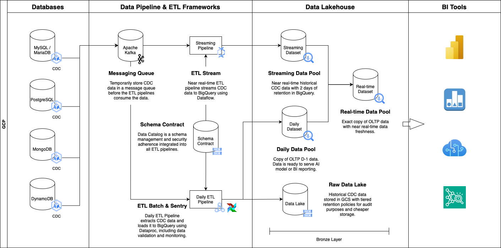

# ETL

The ETL project is a comprehensive solution for managing data pipelines in both batch and streaming modes. It
facilitates efficient data extraction, transformation, and loading across multiple data layers, leveraging tools like
Apache Spark, Kafka, and Google BigQuery.

## Table of Contents

- [Requirements](#requirements)
- [Architecture](#architecture)
    - [Data Lake](#data-lake-daily)
    - [Data Pool Daily](#data-pool-daily)
    - [Data Pool Stream](#data-pool-stream-streaming)
    - [Data Pool Real-time](#data-pool-real-time)
    - [Data Pool Job History](#data-pool-job-history)
    - [Data Sentry](#data-sentry)
- [Usage](#usage)
    - [Unit Test](#unit-test)

## Architecture

<picture>
  <source media="(prefers-color-scheme: dark)" srcset="images/gcp-architecture-details-dark.png">
  
</picture>

### Data Lake (daily)

Raw data from OLTP databases is stored in Google Cloud Storage (GCS) with the following details.

| Field Name            | Type      | Description                                                                                                                                                                             |
|-----------------------|-----------|-----------------------------------------------------------------------------------------------------------------------------------------------------------------------------------------|
| `ts_ms`               | Long      | The field that displays the time at which the CDC connector processed the event.                                                                                                        |
| `op`                  | String    | The type of operation performed: 'c' for create, 'u' for update, 'd' for delete.                                                                                                        |
| `source`              | String    | The source field is structured exactly as standard data change events that the connector writes to table-specific topics. This field is useful to correlate events on different topics. |
| `before`              | String    | An optional field that specifies the state of the row before the event occurred.                                                                                                        |
| `after`               | String    | An optional field that specifies the state of the row after the event occurred.                                                                                                         |
| `_datetime_partition` | Timestamp | The timestamp partition in format `yyyy-MM-dd'T'HH:00:00`.                                                                                                                              |

### Data Pool (daily)

An exact copy of OLTP data is stored in Google BigQuery with **daily** updates. The tables are organized in a BigQuery
dataset following a specific format.

- `<prefix>_daily_<source>`

Example:

- `bronze_daily_mysql`
- `bronze_daily_postresql`
- `bronze_daily_mongodb`

| Field Name         | Type      | Description                                                      |
|--------------------|-----------|------------------------------------------------------------------|
| `id`               | Long      | The primary or foreign keys of the OLTP databases.               |
| ...                | ...       | The other fields that you register in the Schema Contract.       |
| `_is_deleted`      | Boolean   | The status of the row: `True` if deleted, `False` if not.        |
| `audit_write_time` | Timestamp | The timestamp when the record was written for auditing purposes. |

### Data Pool Stream (streaming)

An **append-only** of OLTP data is stored in Google BigQuery, featuring real-time updates with **two days** of
retention. The tables are organized in a BigQuery dataset following a specific format.

- `<prefix>_stream_<source>`

Example:

- `bronze_stream_mysql`
- `bronze_stream_postresql`
- `bronze_stream_mongodb`

| Field Name          | Type      | Description                                                                              |
|---------------------|-----------|------------------------------------------------------------------------------------------|
| `id`                | Long      | The primary or foreign keys of the OLTP databases.                                       |
| ...                 | ...       | The other fields that you register in the Schema Contract.                               |
| `_is_deleted`       | Boolean   | The status of the row: `True` if deleted, `False` if not.                                |
| `_table_name`       | String    | The name of the source table.                                                            |
| `_source`           | String    | The source system. E.g., MySQL, PostgreSQL, MongoDB.                                     |
| `_op`               | String    | The type of operation performed: 'c' for create, 'u' for update, 'd' for delete.         |
| `_ts_partition`     | Long      | The native timestamp of the database transaction logs in format `yyyy-MM-dd HH:mm:ss z`. |
| `_file`             | String    | The binlog filename. This field will appear on the MySQL table only.                     |
| `_pos`              | Long      | The binlog position. This field will appear on the MySQL table only.                     |
| `_lsn`              | Long      | The log sequence number. This field will appear on the PostgreSQL table only.            |
| `_ord`              | Long      | The order of data. This field will appear on the MongoDB table only.                     |
| `_audit_write_time` | Timestamp | The timestamp when the record was written for auditing purposes                          |

### Data Pool Real-time

An exact copy of OLTP data that is created by combining **daily** and **streaming** tables using BigQuery views to offer
real-time updates. The tables are organized in a BigQuery dataset following a specific format.

- `<prefix>_real_time_<source>`

Example:

- `bronze_real_time_mysql`
- `bronze_real_time_postresql`
- `bronze_real_time_mongodb`

| Field Name    | Type    | Description                                                |
|---------------|---------|------------------------------------------------------------|
| `id`          | Long    | The primary or foreign keys of the OLTP databases.         |
| ...           | ...     | The other fields that you register in the Schema Contract. |
| `_is_deleted` | Boolean | The status of the row: `True` if deleted, `False` if not.  |

### Data Pool Job History

TBA

### Data Sentry

TBA

## Requirements

- **Java Version**: 8 or higher
- **Build Tool**: Maven or Gradle
- **Dependencies:**
    - Apache Spark with Kafka integration SDK
    - Apache Beam with Kafka integration SDK
    - AWS Deequ SDK
    - Google Cloud Dataproc SDK
    - Google Cloud Dataflow SDK
    - Google Cloud BigQuery SDK

## Usage

### Unit Test

To run unit tests, execute the following command.

```shell
./gradlew clean test
```
